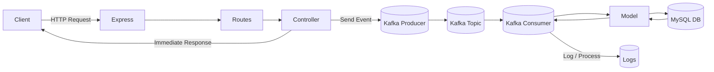
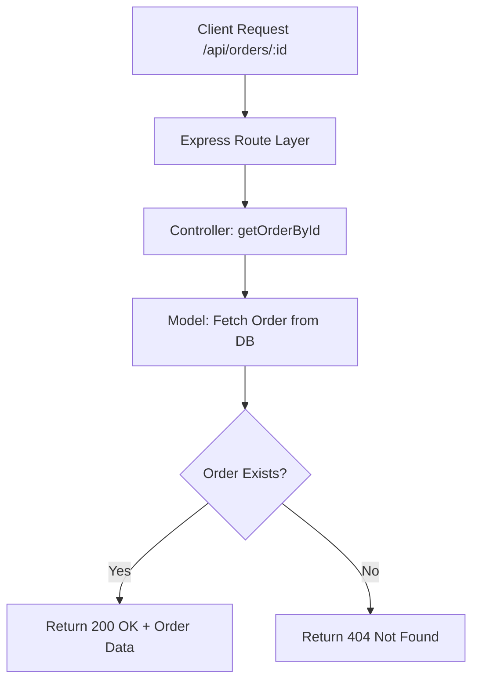
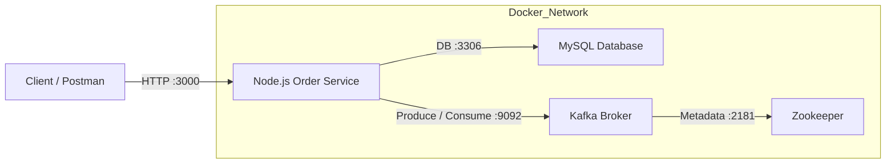
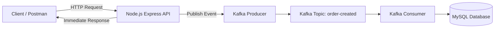

# Order Service (Node.js + MySQL + Docker)

A backend **Order Service** built using **Node.js**, **Express**, and **MySQL**, designed with a clean MVC structure and containerized using **Docker**. This project is part of an **event‑driven system roadmap** (Kafka planned next).

---

## Tech Stack

* **Node.js**
* **Express.js**
* **MySQL 8**
* **Docker & Docker Desktop**
* **Kafka**
* **MVC Architecture**
* **REST APIs**

---

## Project Structure

```
order-service/
│
├── src/
│   ├── controllers/
│   │   └── order.controller.js
│   ├── routes/
│   │   └── order.routes.js
│   ├── models/
│   │   └── order.model.js
│   ├── db/
│   │   └── mysql.js
│   └── app.js
│
├── Dockerfile
├── package.json
├── package-lock.json
└── README.md
```

---

## API Flow (High Level)



---

## REST API Endpoints

| Method | Endpoint          | Description        |
| ------ | ----------------- | ------------------ |
| POST   | `/api/orders`     | Create a new order |
| GET    | `/api/orders`     | Get all orders     |
| GET    | `/api/orders/:id` | Get order by ID    |
| PUT    | `/api/orders/:id` | Update order by ID |
| DELETE | `/api/orders/:id` | Delete order by ID |

> Same endpoint with different HTTP methods is **REST standard practice**.

---

## Controller Flow (Example: Get Order by ID)



---

## Docker Architecture


### NOTE : Node.js runs as a producer and consumer inside Docker, publishing events to Kafka, consuming them asynchronously, and persisting final state in MySQL.

### Important Docker Rules

* Containers **communicate using container names**, not `localhost`
* MySQL **always runs on port 3306 inside Docker**
* Host port (e.g. 3307) is only for local machine access
* Data is persistent using Docker volumes

---

## MySQL Connection (Sanitized)

* Host: `mysql` (container name)
* Port: `3306`
* Credentials: **stored via environment variables (recommended)**

> Sensitive data like passwords and secrets are intentionally excluded.

---

## Database Strategy

✔ Tables are not auto-created
✔ Tables created using migration SQL
✔ Data persists using Docker volumes
✔ Tables are NOT recreated on container restart
✔ Only recreated if volume is deleted

---

## Running the Project (Docker)

1. Start Docker Desktop
2. Build Node image
3. Run MySQL container
4. Run Node container
5. Run kafka container
6. Test APIs using browser or curl

Example:

```
curl http://localhost:3000/api/orders
```

---

### Kafka Integration 

Kafka is used to:
* Decouple order creation from database persistence
* Enable asynchronous processing
* Improve scalability and fault tolerance
* Prepare the system for future microservices


* Client gets instant response
* Order creation is event-driven
* Kafka sits between API and DB
* Consumer handles DB persistence asynchronously
  

## Common Issues & Fixes

### DB Connection Error

* Ensure MySQL container is running
* Ensure database exists
* Ensure Node uses `host: mysql`
* Restart container after config changes

---

## Future Enhancements

* Authentication (JWT)
* Order status events (CREATED, CONFIRMED, CANCELLED)
* Logging & monitoring

---

## Author

**Abhishek Singh**
Backend Developer (Node.js | MySQL | Docker | Kafka )

---

## Notes

This README is designed to be:

* Easy to extend as the system grows

Other microservices and advanced system‑design notes will be added later.
